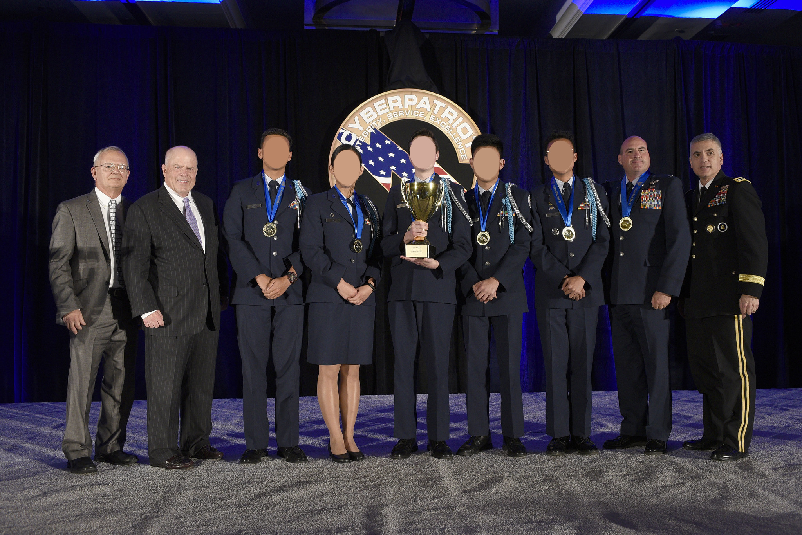

TL;DR: CyberPatriot was a _ton_ of fun and was the perfect blend of competition and self study to capture my interest intensely. I'm overjoyed that we won first place in All Service, and I'm overjoyed that my effort paid off.

With that said, let me take you through the saga. I previously thought you had to be some kind of cybergod to place, but that's simply not true.

### I. My Experience

**CyberPatriot has been one of the most enjoyable and fulfilling experiences of my time in high school.**

I want to preface this post with the previous sentence, because any of my criticisms of the program are far outweighed by the positive influence of CyberPatriot, both in my life and in the lives of many others. 

Beware, this post is written from my colored perspective and is narcissistically focused on myself (although the intention is to discuss the impact of CyberPatriot through the lens of one of its participants). 

#### Section 1: My Introduction

Going into high school, I thought I wanted to be a software engineer at a place like Google or Microsoft (ambitious, I know): all I knew was that I liked computers. I also enjoyed physical security, locks, lock picking, and taking things apart, but that would never be applicable in any computer-related field. Software engineering was the only field I had exposure to. Although I had looked at job postings for "Site Reliability Engineers" or a few security positions, I had never considered them to be any kind of goal, because I thought it was out of my scope. My mental image of these positions were people stuck in dark, medieval data centers, rapidly replacing broken wires and faulty hard drives for their 9-5. 

I saw a "CyberPatriot" poster at my school and figured I would apply. I liked computers, I played (probably too many hours of) video games, I'd probably be good at it. As one of the competitors on one of the freshmen teams, I wasn't able to do much, however this was due mostly to the poor administration of the program at the time (at our school). Although CyberPatriot could make it a lot easier to get introduced to the program, as I've previously argued, it is in the end an academic competition, and an inability to use the materials provided indicates the want of pedantic tendencies that would be necessary to make it to Nationals; I don't fault CyberPatriot in any way for my lack of involvement freshmen year. The point was, it was a simple introduction, and although I didn't accomplish anything, I acquired a goal to make it onto Varsity the following year.

#### Section 2: A Lucky Encounter

I greatly respect the goal behind CyberPatriot, the people who run it, the AFA, and of course fellow competitors. My second year, after building a _very_ basic script to help get onto our "Varsity" team, Frank (a fantastic dude) was persistent enough to help teach me (or rather, encourage self-study) and our other team members. **This** was the jump that would make CyberPatriot more fulfilling for a majority of the teams, that (or rather, who) I happened to be lucky enough to encounter: _a competent, persistent, dedicated person interested in CyberPatriot._

This competition is a rather dull, distilled image of cybersecurity, which makes it all the more exceptional. There is no threat or malicious actor (besides the competitor themself), yet the competition is exciting, adrenaline-fueled, and fulfilling. Being able to receive gratification for self study in the infosec field gave me enough motivation to continue to pursue it, and realize that it was an immensely interesting field. It was like computer science, but more practical. In no other field could I read about how something worked in a book, then type at my computer and have practical experience with ten minutes, or walk outside my room and have a new view of the appliances that drive much of our lives. It also helps that infosec is a rapidly growing field with a lot of opportunities, like CyberPatriot itself.

Thus, I attribute it mostly to Frank, and a bit to myself for self-studying Linux skills, that we qualified for Nationals. Going to the Nationals competition in my sophomore year was an extremely enjoyable experience and one that solidified the real-world aspect of this abstract idea of "security": it's real, it's applicable (hey now there's a red team trying to get into your vulnerable machine!), and they're giving me free food. The CyberPatriot office did a fantastic job of encourage national finalists. The trip was completely free, the rooms were nice (although they did attempt to put four people in one relatively small room with two beds), the hotel looked nice. They also showed competitors the money behind cyber security as extra encouragement, with many free things and small touches (such as candy delivered to the competitor's doors when the theme was "Always Food Available"). As an additional benefit, the harbor was a great view. Although we didn't place in the top three in CPIX, in my mind, getting to go there in the first place, surrounded by amazing people of my own age and experts in the field, was winning.

Or this was my point of view, at least. I lacked the self confidence due to the grand nature of the program, I thought that getting to nationals at all (in All Service, no less) was the most I could ask for and obtain. This was my critical mistake, along with not knowing how to study and practice.

#### Section 3: Independence

And, next comes CyberPatriot X, and as team captain, my team made it to Nationals once more (100 points above second place, while second place was 3 points above third). Although, we didn't place top in All Service in the online rounds. This year was very exciting, especially as I got to assume more responsibility. The experience was mostly a revamped version of the previous year, and one that I felt much more burden for, whether in succeeding or not. And succeed we did not. We placed fifth, which warrants no monetary prize, and did fairly poorly on the largest section of the competition (Network Security Master Challenge), with a solid -400 points from SLA violations. But this failed to discourage me (in the long term)-- all it really did was illuminate my lack of experience and practical ability. I used this to motivate myself even more for the following year, CyberPatriot XI, my final year as I was a senior in high school.

Make no mistake, I was absolutely discouraged. The events of CyberPatriot X for me, due to no other than my own lack of knowledge about myself and others on my team. I needed to adjust my sights much higher: first place at Nationals (for All Service-- I wasn't about to ditch my unit and friends). Without failing and having an extremely high goal to compensate for my lackluster goals during CPX, I doubt my team would've won.

This year I also had a very toxic mindset for 'winning' the competition, in which I thought I could just carry myself and I didn't need to teach any of my teammates. Obviously I couldn't even carry myself, and expecting to carry four other people single-handedly is foolish.

Achieving a greater understanding of my own idiosyncrasies and habits through studying for the CCENT and reading a lot helped me tons, and thus began the next year. At the end of this year as well, I (along with a few other teams) compiled a list of complaints and suggestions, and emailed it to the CyberPatriot Office.

#### Section 4: CyberPatriot XI

I started this year with a single goal: place first in All Service at Nationals. I had the previous experience to know what I did wrong and what kind of challenges were at Nationals (not really the same as the online rounds), over the summer I studied for my CCENT, spent a lot of time on HacktheBox, rewrote our checklists with a focus on 'active defense,' and most importantly, I spent a TON of time practicing, with and without my teammates.

The previous year I put together, with a friend from another team, a list of suggestions for changes in CyberPatriot (17 suggestions) and I emailed them to the CyberPatriot Office. Although they didn't respond, I saw a lot of the changes we suggested put into place, and that was really neat. It was like seeing that they were listening and more human than I previously thought.

Anyhow, the actual Nationals experience started poorly because our flight got canceled, but we made it anyhow and practiced with the probable services they would give us the night before, then we competed in the NSMC and Cisco challenge, one stress-filled day of waiting and a stress-filled dinner later, we won first place in our division.

I don't really know what insight to glean from this except that I was incredibly motivated to do well to prove to myself that I could (along with my team) succeed. I suppose it is then, worthwhile to examine what created that motivation and how I was able to successfully act upon it. I really enjoy learning how things work, as a 'fundamental' part of myself, and then manipulating those things based on my understanding. I also heavily value planning, and newly, I've acquired the appreciation and value of practice. My classes were also easier this year than last, so I had more time. I guess I don't really know why I was able to spend so much time and energy on CyberPatriot other than it being a clear avenue for me to prove to myself that I can do something of this sort.

So, set a goal, and make sure you really really really really really want to obtain that goal, then plan out a possible path (even if it changes a lot-- you don't know what you don't know so how can you teach yourself if you don't know what to teach? Just guess) and follow it.

### II. Criticisms

There is not enough **technical information** or resources provided for new teams or competitors. This is easily remediated by providing a list of 'suggested readings' or articles. It's incredibly difficult to get an accurate scope of vulnerabilities or study material with the modules provided by CyberPatriot without prior knowledge about system hardening or infosec.

CyberPatriot has limited technical powerpoints (which are helpful), but the subsection of the pool of _possible_ vulnerabilities that CyberPatriot chooses to use must be enumerated through trial and error, and personal research. In a way, this is a fantastic way to encourage the self-study and rigorous research of securing an operating system, but not if the same subsection is repeatedly reused. With reusing >80% of vulnerabilities, CyberPatriot provided a strong advantage to teams who have competed before and may remember (or store, although that is against their rules) vulnerabilities from previous years. A stronger supply of technical information provided on behalf of CyberPatriot and greater variance of vulnerabilities from year to year would enhance the practical fairness of the program to newer competitors, and raise the accuracy of assessing the competence of older competitors. 

The rule in and of itself that it is not permitted to store or share vulnerabilities hurts the potential of the program as a larger learning experience. Of course, with this system, this rule is required to preserve the integrity of their testing system (which is infrequently modified at its core, as previously mentioned). If they were to release a small subsection of vulnerabilities, and vary their vulnerabilities from year to year and round to round, it would be a good compromise. Also, the rule that people can't publicize anything (resources, guides, scripts, software, anything) related to CyberPatriot to events involving CyberPatriot software seems counter-intuitive to generating more interest in the program. I understand preventing sharing of scripts, but it would seem that guides and resources should be permitted to be publicly accessible, since it's commonplace for teams to 'pass down' knowledge in exactly the same form from one year to another, especially at schools with large CyberPatriot programs.

Another suggestion/criticism involves the qualification for Nationals with the two cateogries. As it stands (CyberPatriot X), there are two tiers (ignoring Middle School): Open divison (any high school, non-JROTC) and All Service division (AFJROTC, NJROTC, AJROTC, MCJROTC, CAP, Naval Sea Cadets). Two teams from each category in All Service go to Nationals (plus one wildcard), and the twelve top teams in the Open Division. CyberPatriot began primarily as a military program and only allowed open high school teams beginning in CPIII, and I don't think that CyberPatriot should remove this division of categories, but to perhaps present a more fair, skill-based competition (given that Open teams often perform much better than All Service teams, and have over twice the amount of competitors in All Service as of CPX), CyberPatriot should allow six of the highest Open division teams, and six from All Service (one for each category), and the remaining 12 slots should be reserved for whichever team has the highest score (Open or All Service). This would be a good compromise between a purely skill-based competition and the way it is currently, because I think it is in the best interest of CyberPatriot to **prioritize skill over category**. Or, perhaps, __increase the number of teams at nationals__ (this may not be a good idea if logistically not favorable).

My final criticism is that many schools have mentors that have previous knowledge of most of the vulns, and, due to the first point, have multiple high-scoring teams. This year, CPX in 2018, all the Open division National finalists are from five schools. Five schools sending up to three teams each. In order to allow diversity of competitors and reduce advantage due to a coach, **allowing only one team per school** would be a good decision.

### III. Moving Forward

The people running the CyberPatriot program are fantastic and I thank them for their commitment to the field and in younger people. Being exposed to CyberPatriot, and hopefully a competent mentor, is invaluable for students who have an inclination towards computers but are not yet sure what they want to do in life. You never know if you'll love it if you don't try.

